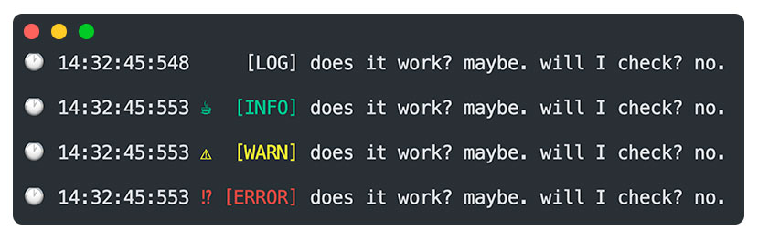

<p align="center">
  
</p>

<h1 align="center">Pretty Console Colors</h1>

<p align="center">🌈 Show your console messages much more visible and intuitive. The terminal much more friendly.</p>

<p align="center">
  <a title="MIT License" href="LICENSE.md">
    
  </a>
  <a title="Twitter: JoseJ_PR" href="https://twitter.com/JoseJ_PR">
    
  </a>  
  <a title="Github: Sponsors" href="https://github.com/sponsors/JoseJPR">
    
  </a>
  <br />
  <br />
</p>

<p align="center">
  
</p>

## 🔖 Description

This module improve the User Experience when he has to detect information within the log of his terminal. You can display information in a friendly and easy to read.

## 📐 How to work with this project

Install this module into your project.

```bash
npm i pretty-console-colors
```

## 🚀 Run

Include the library in your main file.

```js
// Get color Console Libary
import 'pretty-console-colors';

// Show pretty console logs
console.log('👋 Log: Hi from NodeJS');
console.info('👋 Info: Hi from NodeJS');
console.warn('👋 Warn: Hi from NodeJS');
console.error('👋 Error: Hi from NodeJS');
```

## 📂 Code Scaffolding

```any
/
├── assets 🌈                   # Images Sources.
├── doc                         # QAC Documentation.
├── example                     # Local example.
├── src 📦                      # Main file library.
└── ...
```

## ⛽️ Review and Update Sependencies

For review and update all npm dependencies of this project you need install in global npm package "npm-check-updates" npm module.

```bash
# Install and Run
$npm i -g npm-check-updates
$ncu
```

## License

[MIT](LICENSE.md)

## Happy Code

Created with JavaScript, lot of ❤️ and a few ☕️

## This README.md file has been written keeping in mind

[GitHub Markdown](https://guides.github.com/features/mastering-markdown/) \
[Emoji Cheat Sheet](https://www.webfx.com/tools/emoji-cheat-sheet/)
