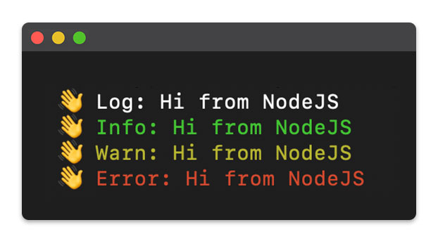

# Pretty Console Colors [](https://github.com/RichardLitt/standard-readme)

🌈 Show your console messages much more visible and intuitive. The terminal much more friendly.



## Installation

```bash
npm i pretty-console-colors
```

## Run

Include the library in your main file.

```js
// Get color Console Libary
require('pretty-console-colors');

// Show pretty console logs
console.log('👋 Log: Hi from NodeJS');
console.info('👋 Info: Hi from NodeJS');
console.warn('👋 Warn: Hi from NodeJS');
console.error('👋 Error: Hi from NodeJS');
```

```bash
node .
```

## Example
You can see an example 
[HERE](example/README.md)

## Maintainers
 \
[@JoseJPR](https://github.com/JoseJPR)

## Contact
🎓 Linkedin: https://www.linkedin.com/in/josejpr/ \
🐦 Twitter: https://twitter.com/JoseJ_PR \
📧 Send email to: me@josejpr.com

## License
[MIT](LICENSE.md)

## Happy Code
Created with JavaScript, lot of ❤️ and a few 🍺

#### This README.md file has been written keeping in mind:
- [GitHub Markdown](https://guides.github.com/features/mastering-markdown/)
- [Emoji Cheat Sheet](https://www.webfx.com/tools/emoji-cheat-sheet/)